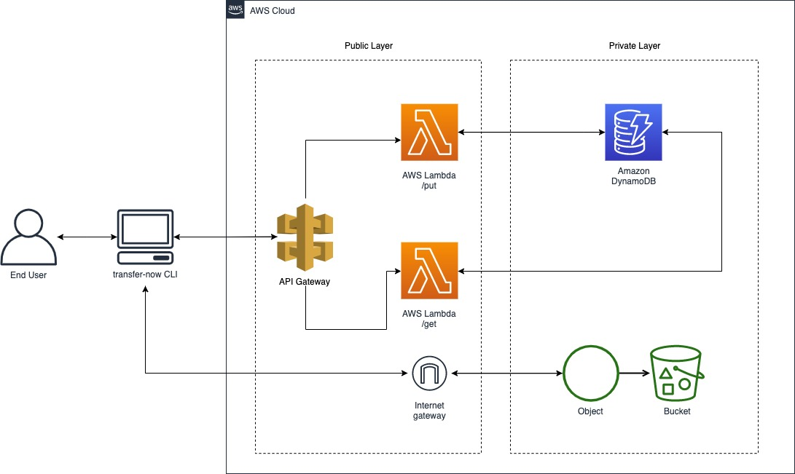

# Transfer Now

> Share your files with people using just the terminal

- [Transfer Now](#transfer-now)
  - [Prerequisites](#prerequisites)
- [Installation](#installation)
    - [Install with npm](#install-with-npm)
    - [Install with Yarn](#install-with-yarn)
    - [Run from without installing](#run-from-without-installing)
  - [Local development](#local-development)
    - [Run the functions](#run-the-functions)
    - [Run the CLI](#run-the-cli)
    - [Run the CLI against Prod](#run-the-cli-against-prod)



## Prerequisites

The CLI has dependencies that require Node 6 or higher, together with NPM 3 or higher.

# Installation

**BEFORE YOU INSTALL:** please read the [prerequisites](#prerequisites)

### Install with npm

```sh
$ npm install -g transfer-now
```

### Install with Yarn

```sh
$ yarn global add transfer-now
```

### Run from without installing

```sh
$ npx transfer-now
```

## Local development

### Run the functions

```sh
$ npm run sls:start
```

This will run a local version of the Serveless functions present under the `src` folder

### Run the CLI

```sh
$ npm run cli -- {method} {name}
```

**eg.**

```sh
$ npm run cli -- put ./README.md
$ npm run cli -- get evil_pink_panther
```

This will [run the cli against your local serverless functions](#run-the-functions).
Please, make sure you're running them locally first, otherwise, [run the CLI against the PROD environment](#run-the-cli-against-prod).

### Run the CLI against Prod

This will run your local CLI against the production Serverless functions

```sh
$ npm run cli:prod -- {method} {name}
```

**eg.**

```sh
$ npm run cli:prod -- put ./README.md
$ npm run cli:prod -- get evil_pink_panther
```
